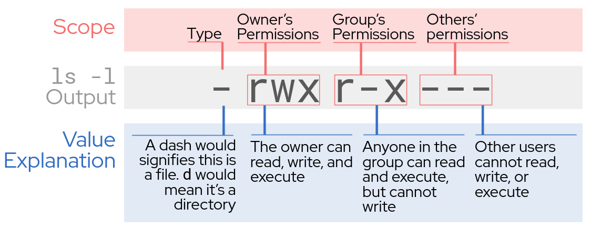

# Ejecutando los primeros permisos.

# Displaying files and their permissions

En este laboratorio, nos familiarizaremos con los primeros comandos que 
correremos en linux

`date`{{execute T1}}

Luego lo ampliamos mas

`date +%R`{{execute T1}}

y luego un poco mas

`date +%x`{{execute T1}}

<pre class=file>
$ date
Mon Nov 15 10:05:24 UTC 2021
$ date +%R
10:05
$ date +%x
11/15/2021
</pre>

