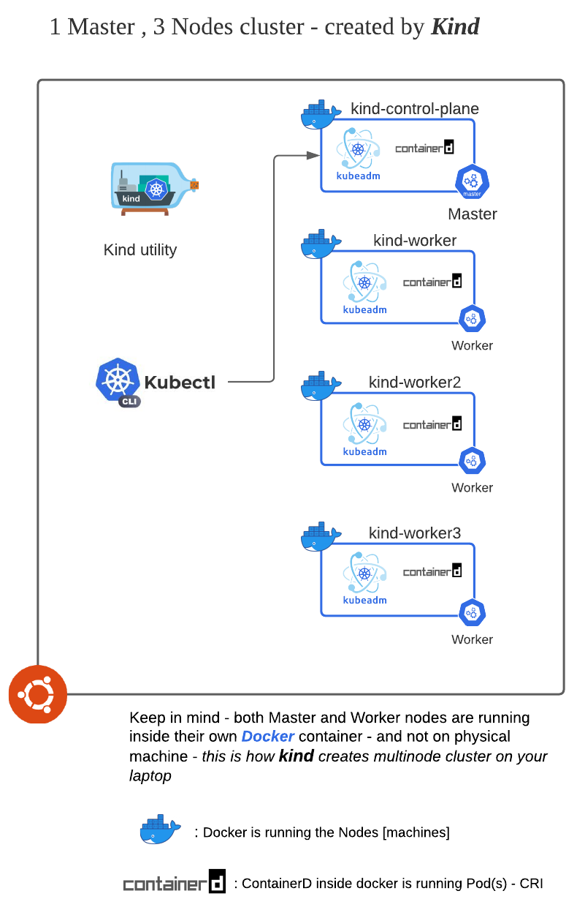

Create cluster 

## Install kind (latest release)

First lets install latest version of Kind - so we can use it to create kubernetes cluster

`./install_kind.sh`{{execute}}

## Create a kind config

We will use below kind config 

`bat kind-cluster.yaml`{{execute}}

## Create a cluster 

This will create 1 control plane (Master) Node and 3 worker Nodes

`kind create cluster --config kind-cluster.yaml`{{execute}} *(this should take 4~5 minutes)*

<details>
  <summary>Sample output: </summary>
  
```
master $ kind create cluster --config kind-cluster.yaml
Creating cluster "kind" ...
 ✓ Ensuring node image (kindest/node:v1.19.1) 🖼
 ✓ Preparing nodes 📦 📦 📦 📦
 ✓ Writing configuration 📜
 ✓ Starting control-plane 🕹️
 ✓ Installing CNI 🔌
 ✓ Installing StorageClass 💾
 ✓ Joining worker nodes 🚜
Set kubectl context to "kind-kind"
You can now use your cluster with:

kubectl cluster-info --context kind-kind

Have a question, bug, or feature request? Let us know! https://kind.sigs.k8s.io/#community 🙂
```       
</details>

## Wait for cluster to be ready 

Let's wait for all Nodes in cluster to post ***Ready*** status before we
continue

`./isClusterReady.sh `{{execute}}

## Cluster

Now we have cluster running as shown below 

1. We have 4 docker containers running each running one of kubernetes
   nodes - Kubernetes version should be latest (1.19.x as of now)
2. One of the docker container is running master/control plane
   components 
3. Other 3 running worker nodes 
4. If you `exec` in one of the docker container you will see they are
   configured using `kubead` and CRI for PODs is `container-d` 
5. Kind has also set up `kubeconfig` so we can use kubectl to
   talk/interact with this cluster


