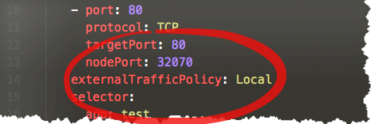
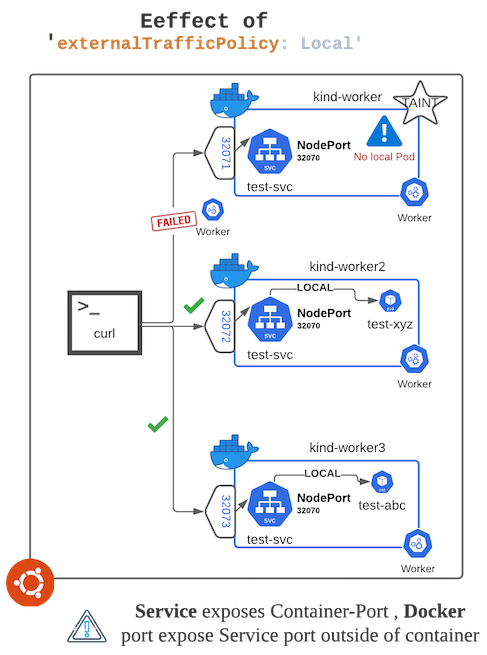

Populate the cluster

Now that we have cluster ready let's play around.

# Test `externalTrafficPolicy: Local`

Let's test out how *externalTrafficPolicy: Local* affects NodePort service
and how it forces it to use local end-points 

We will deploy one simple NGINX Deployment that when invoked will reply
with information about what Pod and what Node (name) its running on .

We will `taint` Node ***kind-worker*** with taint that our deployment/pods don't tolerate
thus - no pods will be scheduled on Node *kind-worker* .

Then we will deploy 2 replicas of this deployment and expose this
deployment using ***NodeType*** service. Service will use *externalTrafficPolicy: Local*

Now due to nature of NodeType port - you can hit on port **32070** on any of
the pods and you should get reply . This is one of the promises of
NodeType service. But since we have added `externalTrafficPolicy` to
`Local` NodePort service (IPTables) on Node *kind-worker* will look for
local pod to forward traffic/packets to - but it will not find it and
we should get Error 

<details>
  <summary>kubectl explain service.spec.externalTrafficPolicy</summary>
  

`kubectl explain service.spec.externalTrafficPolicy`{{execute}}

```
controlplane $ kubectl explain service.spec.externalTrafficPolicy
KIND:     Service
VERSION:  v1

FIELD:    externalTrafficPolicy <string>

DESCRIPTION:
     externalTrafficPolicy denotes if this Service desires to route external
     traffic to node-local or cluster-wide endpoints. "Local" preserves the
     client source IP and avoids a second hop for LoadBalancer and Nodeport type
     services, but risks potentially imbalanced traffic spreading. "Cluster"
     obscures the client source IP and may cause a second hop to another node,
     but should have good overall load-spreading.
```       
</details>

## Create simple NGINX deployment and service

Let's create a simple NGINX base deployment with 2 replicas and expose deployment with service running on port *32070*

Just for simplicity we will make sure that pods get scheduled on node
`kind-worker2` and `kind-worker3` - so lets taint node `kind-worker`

`kubectl taint node kind-worker no=testpod:NoSchedule`{{execute}}

Now we apply below two YAMLs that will create deployment and service

`kubectl apply -f deploy.yaml -f service.yaml`{{execute}} 

### (Optional) View YAML for Deployment and Service

We just created one Deployment (with 2 replicas) and one NodePort service - let check how their *manifest* looks like

#### Deployment [test]:  

If you see closely this deployment uses **sidecar** container to populate
NGINX's default *index.html* with text that has *Pod's Name* and *Node's name*
so when we hit any of these NGINX server we know which Pod we hit and
it's running on what Node . 

`bat --paging=never deploy.yaml`{{execute}}

#### Service [test-vc]: 

`bat service.yaml`{{execute}}


Pay close attention to `externalTrafficPolicy: Local` 



### Check if all pods are running 

`kubectl get deployments.apps test`{{execute}}

Make sure above output shows 2 Pods are available

## Invoke each service on it's HostPort 

As node `kind-worker` has taint on it - we are sure pods will be only
running/scheduled on `kind-worker2` and `kind-worker3` and let's hit
their NodePort and we should get reply

If we hit end-point on `kind-worker2` we should get reply - use below
command to check that 

`curl --max-time 4 http://0.0.0.0:32072`{{execute}}

Sample output: 

```BASH
controlplane $ curl http://0.0.0.0:32072
Reply from POD: [test-6d9c9d5b86-lwzwx] running on Node: [kind-worker2]
```

Same goes for `kind-worker3` 
 
`curl --max-time 4 http://0.0.0.0:32073`{{execute}}

Sample output : 

```BASH
controlplane $ curl http://0.0.0.0:32073
Reply from POD: [test-6d9c9d5b86-nk28k] running on Node: [kind-worker3]
```
 

** **NOTE** ** : Now you might think why are we not hitting on Nodes
IP/Host name and on port 32070 ? This is because we are using **Kind** and
the Nodes are running inside Docker container. So , we can't hit Node's
port 32070 - instead we have to map that port to local server and we can
only hit those ports.

You can see below we have asked kind to do this port mapping for us
*before* hand so we don't have to anything now.



### Invoke same end-point on `kind-worker` node

We expect below curl command to **fail** as - there is no local `test` pod running
on *kind-worker* node and as test-svc service is suppose to look for LOCAL
end-point (because of *externalTrafficPolicy: Local*) it will fail

Lets call with timeout if end-point is not working it will ***fail*** in 4
seconds 

`curl --max-time 4 http://0.0.0.0:32071`{{execute}}

Sample output: 

```
master $ curl --max-time 4 http://0.0.0.0:32071
curl: (28) Operation timed out after 4000 milliseconds with 0 bytes received
```

So, now we know what is impact of setting `externalTrafficPolicy: Local` on NodePort service. It is very important to
understand how things works before we start using it . On next page we dig little deeper and see what exactly happens when 
we set *externalTrafficPolicy: Local*