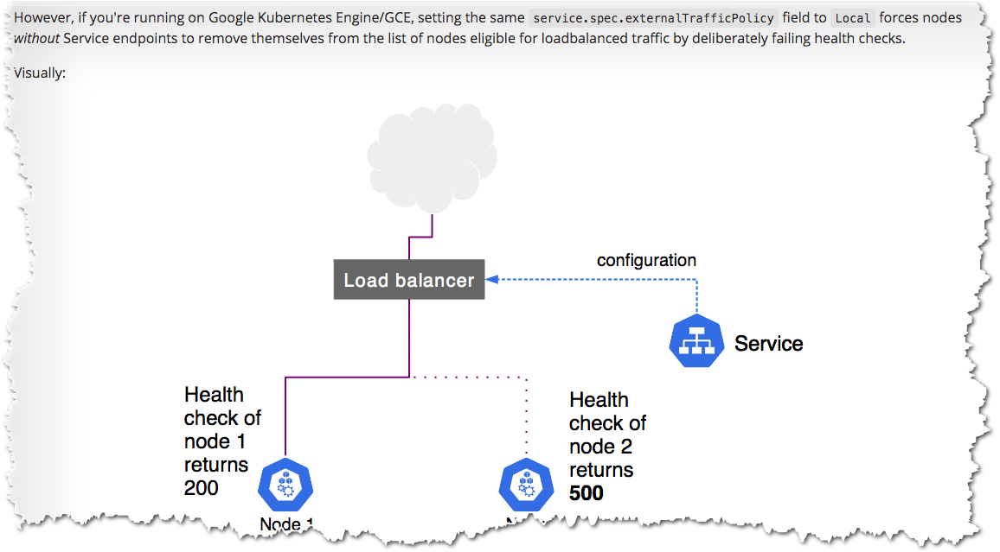

Teardown 

## Cleaning up

Using kind you can easily teardown everything it created 

`kind delete cluster --name kind`{{execute}}

### Note on GCE 

As see in Kubernetes doc on Google Kubernetes Engine/GCE - if you set `externalTrafficPolicy: Local` on service and there is no local provider then Node will be removed 
from list of end-points for NodePort service.

Read more @ [link](https://kubernetes.io/docs/tutorials/services/source-ip/#source-ip-for-services-with-type-loadbalancer)

