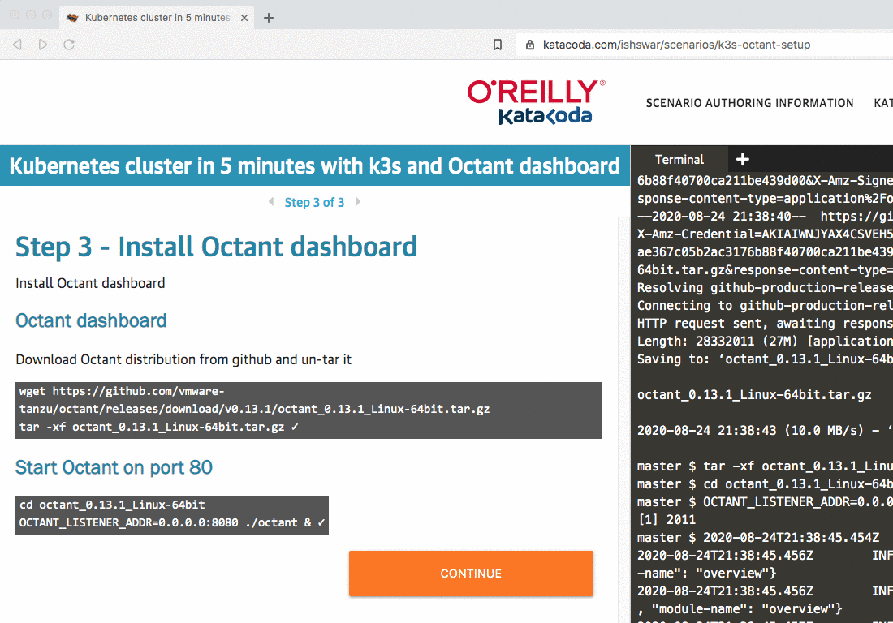

Install Octant dashboard 

## Octant dashboard 

Download [Octant](https://octant.dev/) distribution from github and un-tar it 

`
wget https://github.com/vmware-tanzu/octant/releases/download/v0.13.1/octant_0.13.1_Linux-64bit.tar.gz
tar -xf octant_0.13.1_Linux-64bit.tar.gz
`{{execute}}

## Start Octant on port 8080 

`
cd octant_0.13.1_Linux-64bit
OCTANT_LISTENER_ADDR=0.0.0.0:8080 ./octant > /dev/null 2>&1 &
echo "We are done - you are free to explore cluster"
`{{execute}}

Octant uses ~/.kube/config file to get/fetch data from cluster 

## Open Octant dashboard 

If you use above command to start Octant dashboard than - dashboard is now available at port 8080
You can open dashboard using below steps : 

Click on below link to access dashboard 

[Octant dashboard](https://[[HOST_SUBDOMAIN]]-8080-[[KATACODA_HOST]].environments.katacoda.com)

Or you can use below steps to get same : 

